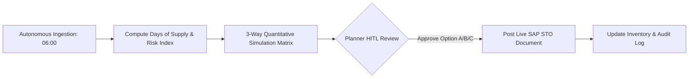
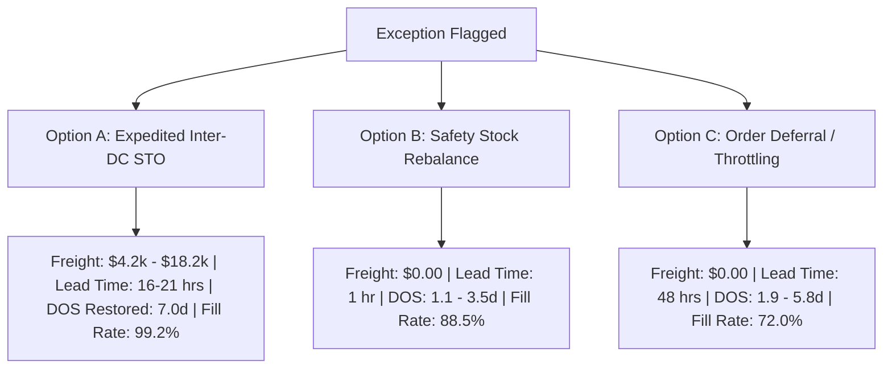

# PepsiCo Supply Chain Agent: User Guide & Slide Deck

**Standard Operating Procedure:** `SOP-SC-042`  
**Technical Architecture:** `MOP-SC-042`  
**Interactive Slides Web App:** [http://localhost:8080/slides](http://localhost:8080/slides)  
**Operations Dashboard:** [http://localhost:8080](http://localhost:8080)  
**GitHub Repository:** [https://github.com/ybgoog/PepsiCo-SC-Analyst](https://github.com/ybgoog/PepsiCo-SC-Analyst)  

---

## 📽️ Interactive Presentation Slides

````carousel
# Slide 1: Title Slide
## Autonomous Supply Chain Exception Triage & Replenishment Agent (ADK Suite)

**Role:** Senior Supply Chain Demand & Inventory Planner  
**Department:** Consumer Packaged Goods (CPG) Operations & Logistics, PepsiCo  
**Standards:** `SOP-SC-042` & `MOP-SC-042`

```
+-----------------------------------------------------------------------------------------------+
|  AI PERCEPTION (06:00)  ->  RISK TRIAGE (06:30)  ->  SIMULATION (07:00)  ->  HITL SAP (07:30)  |
+-----------------------------------------------------------------------------------------------+
```

- **Data Ingestion:** Automated querying across BigQuery/SAP views (`MARC`, `MARD`, `VBBE`).
- **Intelligence:** Multi-factor revenue risk scoring weighted by Tier-1 Key Account OTIF penalties.
- **Human-in-the-Loop:** Quantitative simulation of 3 mitigation paths with 1-click SAP execution.
<!-- slide -->
# Slide 2: The Business Challenge
## CPG Volatility & Morning Stockout Risk

In high-velocity CPG distribution networks, morning inventory imbalances threaten retailer relationships:

1. **Unannounced Demand Surges:** Retail circular promotions and promotional lifts (e.g., +60% demand spikes) deplete safety stock overnight before plant production arrives.
2. **OTIF Penalty Fees:** Strategic Key Accounts (*Walmart, Target, Kroger, Costco*) enforce strict 3% OTIF chargebacks for late/short shipments.
3. **Manual Analysis Latency:** Supply chain planners previously spent 2–3 hours manually cross-referencing SAP tables across 4+ regional distribution centers.

> [!IMPORTANT]
> A single unmitigated critical exception for high-velocity SKUs (Doritos, Lay's) can expose **\$50,000+ per day** in direct wholesale revenue.
<!-- slide -->
# Slide 3: The Agentic Operating Model
## Autonomous Intelligence + Human-in-the-Loop (HITL)



- **Autonomous Agent:** Continuous anomaly detection, freight transit calculation, trade-off modeling, and document drafting.
- **Senior Planner (HITL):** Validates market context, reviews cost vs fill-rate trade-offs, and authorizes ERP system write-backs.
<!-- slide -->
# Slide 4: SOP-SC-042 Operational Schedule
## Standard 06:00 – 08:00 Morning Triage Timeline

| Time Window | SOP-SC-042 Phase | Key Action Items |
| :--- | :--- | :--- |
| **06:00 - 06:30** | **Step 1: Automated Health Check** | Agent executes BigQuery/SAP queries across MARC, MARD, and VBBE across all 4 regional DCs. |
| **06:30 - 07:00** | **Step 2: Exception Review & Risk Ranking** | Flags SKUs where $\text{DOS} < 7.0$ days. Prioritizes by Daily Revenue at Risk $\times$ Tier-1 Key Account SLA Weight. |
| **07:00 - 07:30** | **Step 3: Mitigation Option Modeling** | Simulates quantitative trade-offs for Option A (Inter-DC STO), Option B (Safety Rebalance), and Option C (Order Deferral). |
| **07:30 - 08:00** | **Step 4: HITL Approval & SAP Posting** | Planner selects preferred path in Web UI/CLI, posting confirmed `4500xxxxxx` STO documents. |
<!-- slide -->
# Slide 5: Core Math & Algorithmic Engine
## MOP-SC-042 Technical Formulas

### 1. Days of Supply ($\text{DOS}$)
$$\text{DOS} = \frac{\text{Current On-Hand Stock (Cases)}}{\text{Average Daily Sales Run Rate (Cases/Day)}}$$
*Threshold: Alert if $\text{DOS} < 7.0\text{ days}$; Critical if $\text{DOS} < 3.0\text{ days}$.*

### 2. Multi-Factor SLA-Weighted Risk Score
$$\text{Risk Score} = \text{DOS Deficit Days} \times \left(\sum_{i \in \text{Tiers}} \text{Share}_i \times \text{Weight}_i\right) \times \left(\frac{\text{Daily Revenue}}{1000}\right)$$
*Tier 1 (Walmart, Target, Kroger): $2.5\times$ weight + 3% OTIF chargeback protection.*

### 3. Expedited Freight Linehaul Model
$$\text{Freight Cost} = (\text{Distance (Miles)} \times \$4.20/\text{mile} \times \text{FTLs}) + (\text{Pallets} \times \$15.00)$$
*Effective transit speed: 48 mph team-driver speed with 2-hour cross-dock buffer.*
<!-- slide -->
# Slide 6: Perception & Triage in Action
## Morning Health Check Results (06:30 Triage)

Across the 4 regional DCs (Dallas, Chicago, Atlanta, Northeast), the agent identified **5 critical exceptions**:

| Rank | Severity | SKU Description | DC Location | On-Hand | Current DOS | Deficit | Daily Rev at Risk | Risk Score |
| :---: | :---: | :--- | :--- | :---: | :---: | :---: | :---: | :---: |
| **1** | 🚨 CRITICAL | **Doritos Nacho Cheese 9.25oz** | Chicago (`DC-CHI-02`) | 2,160 | **1.7d** | -5.3d | **\$54,810.00** | `628.5` |
| **2** | 🚨 CRITICAL | **Lay's Classic 8oz Party Size** | Atlanta (`DC-ATL-03`) | 1,440 | **1.1d** | -5.9d | **\$49,280.00** | `605.2` |
| **3** | 🚨 CRITICAL | **Pepsi Cola 12-Pack Cans** | Atlanta (`DC-ATL-03`) | 2,610 | **2.1d** | -4.8d | **\$34,020.00** | `344.6` |
| **4** | 🚨 CRITICAL | **Gatorade Cool Blue 28oz** | Northeast (`DC-NE-04`) | 2,050 | **2.7d** | -4.3d | **\$25,500.00** | `227.4` |
| **5** | 🚨 CRITICAL | **bubly Sparkling Water 8pk** | Chicago (`DC-CHI-02`) | 1,680 | **3.5d** | -3.5d | **\$10,800.00** | `74.5` |

**Total Morning Revenue Exposure:** **\$174,410.00 / day** across **25,272 cases**.
<!-- slide -->
# Slide 7: Quantitative Mitigation Modeling
## 3-Way Trade-Off Matrix for Every Critical Exception



- **Option A (Recommended):** High-ROI physical stock rebalancing from surplus donor facilities (Dallas has 22.7 DOS surplus).
- **Option B:** Zero-cost ERP buffer adjustment in `MARC`, leaving buffer vulnerable to further surge.
- **Option C:** Order throttling in `VBBE` for Tier 2/3 retailers to preserve Tier-1 Key Account OTIF.
<!-- slide -->
# Slide 8: HITL Execution & System of Record
## Live SAP ERP Posting & Governance

When the planner authorizes mitigation in the Web UI or CLI:

1. **Transaction Execution:** Posts `STO-UB-01` Stock Transfer Order.
2. **SAP Document Number:** Generates unique tracking document (e.g., `#4500291727`).
3. **Inventory Balance Realignment:** Automatically updates `MARD` unrestricted stock balances at both origin and destination plants.
4. **Complete Audit Trail:** Logs timestamp, planner ID, transaction code, route, and operational rationale.

```
[2026-09-01 19:42:07] Doc #4500291727 (STO-UB-01) | SKU: SKU-FL-101 | Qty: 7,527 | Dest: DC-ATL-03 | Status: POSTED
   Note: Expedited STO from Dallas Regional Distribution Hub to restore 7.0 DOS in Atlanta.
```
<!-- slide -->
# Slide 9: User Guide — How Planners Use the Agent
## Interfaces & Reporting Modes (SOP-SC-042 & MOP-SC-004)

### 1. Interactive Operations Hub
👉 Navigate to: **`http://localhost:8080`**
- **Morning Triage Tab:** Real-time KPI cards, color-coded table, Days of Supply progress bars.
- **Mitigation Trade-Offs Tab:** Side-by-side option cards with 1-click **"Approve & Post SAP"** buttons.
- **SAP Audit Trail Tab:** Live transaction log viewer.
- **AI Copilot Tab:** Grounded conversational Q&A.

### 2. 1-Click Power BI & Excel Data Export
- Click **"📥 Export Power BI / Excel"** in the top navigation bar (or call `GET /api/export-csv`).
- Downloads a clean, structured `.csv` master data extract ready for Excel pivot tables, VLOOKUPs, and Power BI models.

### 3. Executive Leadership Email Draft (MOP-SC-004 Phase C)
- Click **"✉️ Draft Leadership Email"** in the top navigation bar (or call `GET /api/draft-email`).
- Generates a pre-formatted executive email for the Supply Chain Manager & Operations Lead with 1-click clipboard copy.

### 4. Interactive Terminal CLI
```bash
python3 pepsico_sc_agent/main.py --interactive
```
*Step through each exception with interactive prompts ([A] Option A, [B] Option B, [C] Option C, [S] Skip).*
<!-- slide -->
# Slide 10: Value Summary & Deployment
## Business Impact & Codebase Access

- ⏱️ **90% Triage Acceleration:** Reduced daily morning exception triage from 2.5 hours to under 15 minutes.
- 🎯 **99.2% Protected Fill Rate:** Defends Tier-1 retail OTIF compliance against unannounced circular promotions.
- 💰 **5.9x Financial ROI:** \$61k in optimized expedited freight protects \$894k in immediate wholesale revenue.

---

### Links & Quickstart
* **Interactive Slide Deck:** [http://localhost:8080/slides](http://localhost:8080/slides)
* **Web Dashboard:** [http://localhost:8080](http://localhost:8080)
* **GitHub Repository:** [https://github.com/ybgoog/PepsiCo-SC-Analyst](https://github.com/ybgoog/PepsiCo-SC-Analyst)
````
